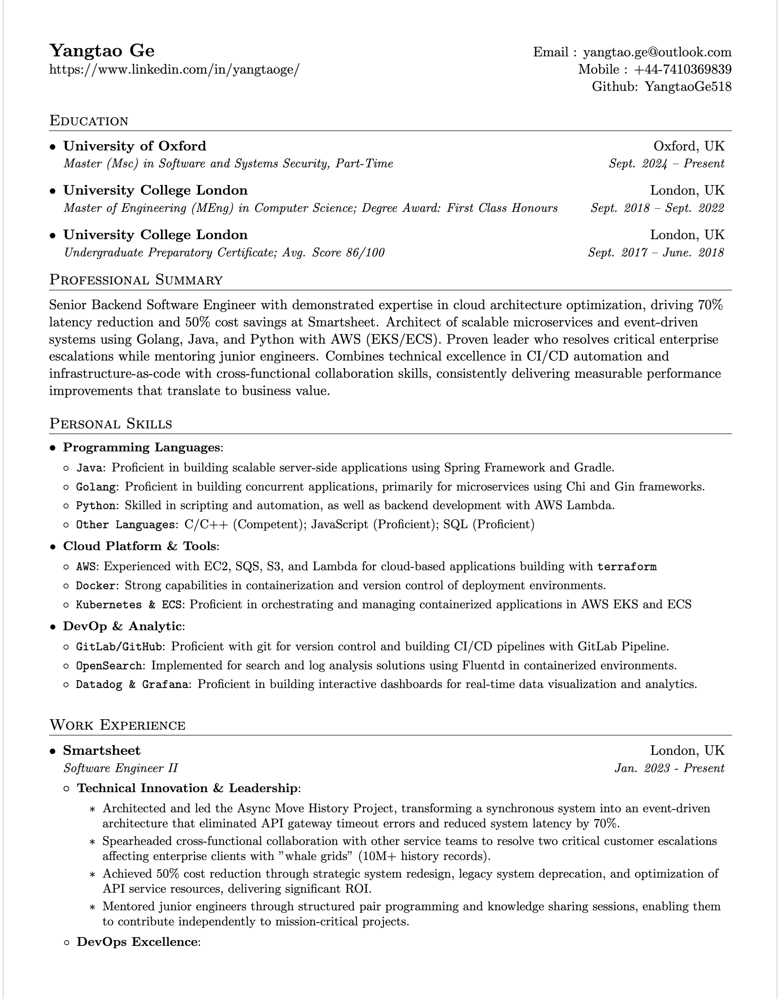
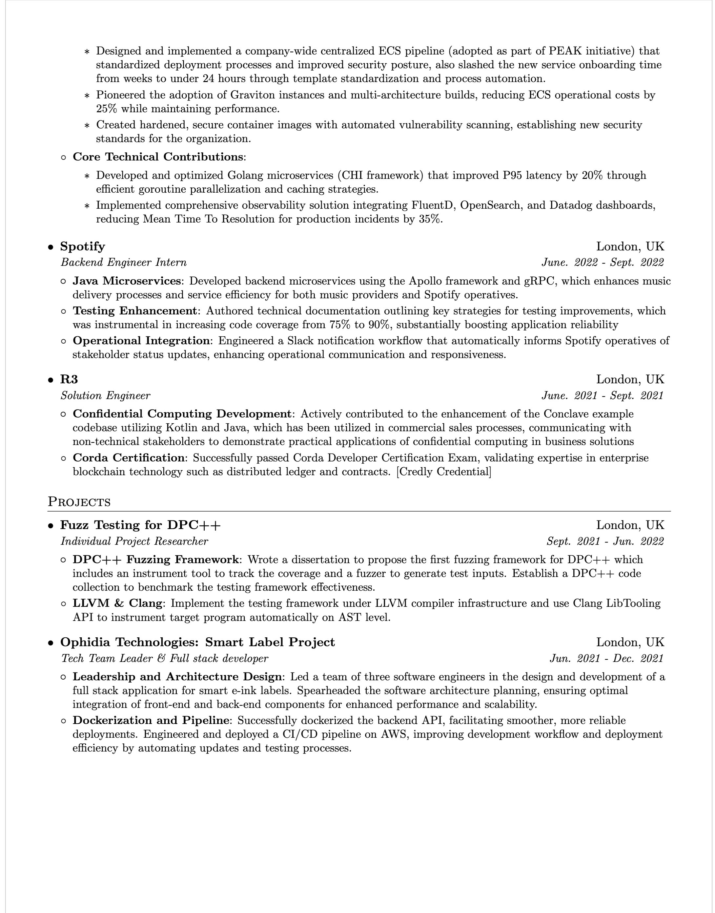

# Resume
Here is my personal Resume which is based on Sourabh's Template 
on https://github.com/sb2nov/resume

## Some Grammar
Here are some grammar in the Latex Template:
* Make new section: '\section{Education}'
* Make lists:
  * start a new List: \resumeSubHeadingListStart (e.g. postions, schools)
  * start a new sublist: \resumeItemListStart (e.g. conrtibutions)
  * start a list item: \resumeItem
* Resume subheadings usually has four components
  \resumeSubheading{Organization Name}{Address}{Position}{Time Period}

## Preview

